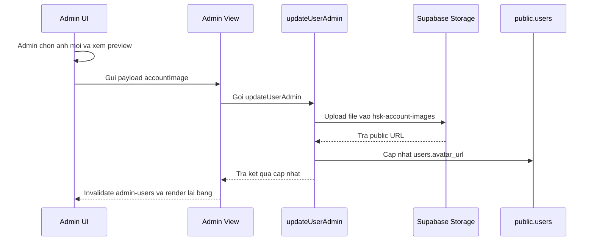

# Tong quan hoat dong trang Admin (Admin Dashboard)

Tai lieu nay mo ta cau truc, luong du lieu va cac khu vuc chinh cua trang Admin trong HSK System.

---

## 1. Kien truc tong quan

- **Route**: `src/routes/admin.tsx`
  - Cong vao trang `/admin`, duoc bao boi `DashboardShell` va yeu cau nguoi dung co quyen phu hop.
- **View / Controller**: `src/components/features/admin/HSK_AdminPanelView.tsx`
  - Quan ly tab, query/mutation React Query, goi server functions va truyen props xuong cac panel UI.
- **UI / Presentation**: `src/components/features/admin/HSK_AdminPanelUi.tsx`
  - Render cac bang, dialog va panel thao tac: quan ly tai khoan, sap xep lop, lop hoc, lesson prep, mapping tai lieu, analytics va audit logs.
- **Server Functions**: `src/lib/hsk.functions.ts`
  - Xu ly cac thao tac admin/care nhu tao tai khoan, cap nhat tai khoan, quan ly lop, upload tai lieu, map tai lieu buoi hoc va ghi audit log.
- **Database / Storage**: Supabase Postgres va Supabase Storage.

---

## 2. Cac tab chinh

1. **Sap xep lop**
   - Gan hoc vien vao lop offline.
   - Tra cuu lop, danh sach hoc vien trong lop, xung dot lich va lich su su kien lop.

2. **Tao tai khoan**
   - Tao tai khoan hoc vien, giao vien, logistics hoac CSKH.
   - Ho tro thong tin co ban: ho ten, email, mat khau, vai tro, loai hoc vien, so dien thoai, ngay sinh, trang thai.
   - Ho tro anh tai khoan: file anh duoc upload len bucket `hsk-account-images`, database chi luu URL tai cot `users.avatar_url`.

3. **Quan ly toan bo tai khoan**
   - Bang danh sach nguoi dung tu `getAllUsersAdmin`.
   - Co the hien/an cot, tim kiem, export CSV, sap xep va thao tac tren tung tai khoan.
   - Dialog chinh sua cho phep cap nhat thong tin tai khoan, dat lai mat khau va thay doi anh tai khoan.
   - Khi chon anh moi, UI preview anh, gioi han dung file anh toi da 2MB, gui `accountImage` ve `updateUserAdmin` de upload va cap nhat `avatar_url`.

4. **Tao lop hoc**
   - Tao, sua, xoa lop.
   - Gan giao vien, cau hinh ngay bat dau/ket thuc, lich hoc, so luong hoc vien toi da, link phong va tai lieu lop.

5. **Chuan bi tai lieu**
   - Quan ly bai hoc HSK theo cap do.
   - Upload/xoa tai lieu bai hoc len bucket `hsk-materials`.

6. **Map tai lieu buoi hoc**
   - Gan bai hoc/tai lieu vao tung buoi hoc theo khoa `class_id + session_date`.
   - Du lieu nay duoc dung de hien thi tai lieu o trang Student va Teacher.

7. **Giao vien & danh gia**
   - Xem thong ke danh gia giao vien.

8. **Audit logs**
   - Theo doi cac thao tac quan trong nhu tao/cap nhat/xoa tai khoan, gan lop, sua lop.

---

## 3. Luong cap nhat anh tai khoan

---

## 4. Ghi chu van hanh

- Anh tai khoan khong luu truc tiep trong database; database chi luu URL.
- Bucket `hsk-account-images` can ton tai va public de cac may khac co the xem anh.
- Server functions dung `supabaseAdmin` voi service role de thuc hien thao tac quan tri, vi vay can cau hinh `SUPABASE_SERVICE_ROLE_KEY` trong moi truong chay server.
- Sau khi sua tai khoan, query `admin-users` duoc invalidate o `HSK_AdminPanelView.tsx` de bang tai khoan hien thi anh/thong tin moi.
