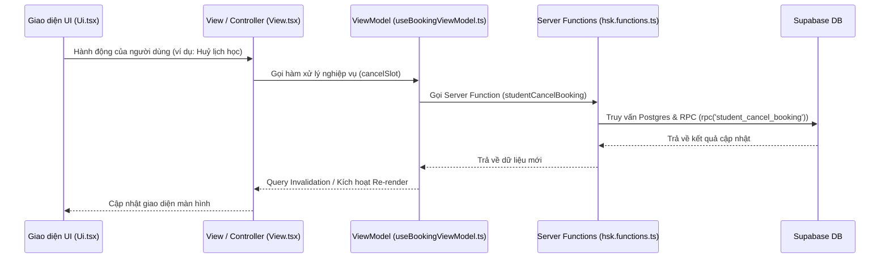

# Tổng quan hoạt động trang Học viên (Student Dashboard)

Tài liệu này cung cấp cái nhìn tổng thể về cách hoạt động, kiến trúc và các cập nhật mới nhất của trang dành cho học viên (Student) trong dự án HSK System.

---

## 1. Kiến trúc thiết kế (Pattern MVVM-Lite)

Trang Student tuân thủ nghiêm ngặt mô hình **MVVM-lite** được định nghĩa trong dự án để tách biệt giao diện hiển thị và logic nghiệp vụ:

*   **Route ([student.tsx](file:///d:/10.%20PJ_HSK_SYSTEM/hsk_system/src/routes/student.tsx))**: Cổng vào route `/student`. Sử dụng `DashboardShell` để kiểm tra quyền đăng nhập (Auth Guard) và hiển thị View chính.
*   **View ([HSK_StudentDashboardView.tsx](file:///d:/10.%20PJ_HSK_SYSTEM/hsk_system/src/components/features/student/HSK_StudentDashboardView.tsx))**: Đóng vai trò là **Controller**. View gọi ViewModel hook để lấy toàn bộ dữ liệu & các hàm xử lý nghiệp vụ, sau đó chuẩn bị/định dạng dữ liệu và truyền xuống UI thông qua props. View không chứa logic hiển thị trực tiếp.
*   **UI ([HSK_StudentDashboardUi.tsx](file:///d:/10.%20PJ_HSK_SYSTEM/hsk_system/src/components/features/student/HSK_StudentDashboardUi.tsx))**: Đóng vai trò là **Presentation**. Chỉ chứa các component UI thuần túy (`ProgressCards`, `BookingsTable`, `AssignmentsTable`), nhận props và render bằng Tailwind CSS + shadcn/ui.
*   **ViewModel ([HSK_useBookingViewModel.ts](file:///d:/10.%20PJ_HSK_SYSTEM/hsk_system/src/hooks/hsk-viewmodels/HSK_useBookingViewModel.ts))**: Quản lý toàn bộ State, gọi các Server Functions (chạy ở backend/Supabase RPC) để truy vấn và cập nhật dữ liệu.

---

## 2. Các luồng hoạt động & Tính năng chính

### a. Quản lý trạng thái học tập (Online vs Offline)
Hệ thống tự động phát hiện loại tài khoản học viên thông qua `student_account_type` của profile người dùng (`me`) hoặc thông qua các khóa học đã đăng ký trong tiến trình học tập (`progress`):
*   **Tài khoản Online (Học 1-1)**: Hiển thị thẻ tiến trình học (còn bao nhiêu buổi trên tổng số buổi) và nút **"Đặt lịch học"** để mở dialog đặt lịch học với giáo viên.
*   **Tài khoản Offline (Lớp cố định)**: Hiển thị thông tin lớp học do **Admin** sắp xếp và gán lịch. Hệ thống tự sinh ra danh sách buổi học mô phỏng theo số buổi, ngày bắt đầu và lịch học (ví dụ: Thứ 2 - 4 - 6).

### b. Biểu đồ Radar đánh giá kỹ năng
*   Giao diện hiển thị một biểu đồ mạng nhện (**Radar Chart** từ thư viện `recharts`) trực quan hóa năng lực học tập của học viên dựa trên **6 kỹ năng**: *Nghe (listening), Nói (speaking), Đọc (reading), Viết (writing), Từ vựng (vocabulary), Ngữ pháp (grammar)*.
*   Dữ liệu này được tổng hợp trung bình từ các đánh giá buổi học do giáo viên chấm sau mỗi buổi học thông qua RPC `get_student_skills`. Nếu chưa có dữ liệu thực tế, hệ thống sẽ sử dụng dữ liệu mẫu (`skillSampleData`) để hiển thị demo.

### c. Quản lý Đặt lịch học & Chính sách hủy lớp (`BookingsTable`)
Bảng lịch học của tôi là nơi tập trung các thông tin chi tiết về các buổi học với các tính năng nâng cao:
*   **Tìm kiếm & Bộ lọc**: Tìm kiếm theo giáo viên, lớp học, trạng thái, thời gian và phân trang.
*   **Chính sách hủy lớp (Cảnh báo mất buổi)**:
    *   Học viên hủy **trước 6 giờ** (Hủy hợp lệ - `cancelled_valid`): Được hoàn trả lại số buổi học vào gói cước.
    *   Học viên hủy **dưới 6 giờ** (Hủy muộn - `cancelled_late`): Sẽ bị mất buổi học đó và không được hoàn trả.
*   **Đánh giá giáo viên**: Đối với các buổi học đã kết thúc (trong quá khứ), học viên có thể bấm nút **Đánh giá** để mở `RatingDialog`, gửi số sao và bình luận về giáo viên đó.

### d. Đóng băng & Kích hoạt lại khóa học (Freeze/Unfreeze)
*   Học viên có thể chủ động tạm dừng (bảo lưu) tiến trình khóa học của mình bằng cách nhấn nút **"Bảo lưu"** trên thẻ tiến độ.
*   Hành động này sẽ thay đổi trạng thái tiến độ khóa học thành `frozen` (tối đa 30 ngày) thông qua server function `freezeCourse`. Khi muốn học lại, học viên chọn **"Kích hoạt lại"** (`unfreezeCourse`).

### e. Quản lý Bài tập và Nộp bài (`AssignmentsTable`)
*   Hiển thị danh sách các bài tập liên quan đến khóa học kèm theo thời hạn nộp bài (Deadline) và điểm số do giáo viên chấm.
*   Học viên có thể nộp file âm thanh cho bài tập nói, hình ảnh hoặc tài liệu PDF trực tiếp từ Dashboard.

---

## 3. Các cải tiến và sửa lỗi mới nhất

### 1. Sửa lỗi ẩn nút Đặt lịch học (Booking Button Visibility Fix)
*   **Vấn đề cũ**: Nút **Đặt lịch học** bị ẩn hoàn toàn nếu học viên không có bất kỳ dòng tiến trình khóa học online nào trong database (hoặc danh sách rỗng), làm học viên không thể mở Dialog để biết tình trạng gói cước của mình.
*   **Giải pháp mới**: Loại bỏ điều kiện kiểm tra `onlineCourses.length > 0` trước khi hiển thị `<HSK_BookingDialog />`. Nút luôn được hiển thị với học viên online; nếu họ hết số buổi học hoặc chưa có khóa học, Dialog sẽ mở ra và thông báo chi tiết: *"Số buổi học trong gói đã hết. Vui lòng đăng ký tiếp khóa học mới..."*.

### 2. Đồng bộ hóa bộ lọc Trạng thái với danh sách lịch học
*   **Vấn đề cũ**: Trạng thái hiển thị trong danh sách buổi học được tính toán động theo thời gian thực (ví dụ: *Sắp diễn ra, Đang diễn ra, Hoàn thành, Đã huỷ*), nhưng bộ lọc trên bảng điều khiển tìm kiếm vẫn dùng các trạng thái kỹ thuật lưu trong CSDL (*Chờ xác nhận, Đã xác nhận, Huỷ hợp lệ, Huỷ muộn*). Điều này gây ra sự bất đồng bộ khi tìm kiếm/lọc.
*   **Giải pháp mới**:
    *   Cập nhật các giá trị lựa chọn trong `<Select>` bộ lọc Trạng thái thành: `Tất cả` (`all`), `Sắp diễn ra` (`upcoming`), `Đang diễn ra` (`ongoing`), `Hoàn thành` (`completed`), `Đã huỷ` (`cancelled`).
    *   Tái cấu trúc hàm `filteredBookings` để tính toán trạng thái hiển thị động của mỗi buổi học thông qua helper `getBookingDisplayStatus` (trùng khớp hoàn toàn với logic hiển thị của component `StatusBadge`). Bộ lọc giờ đây tìm kiếm và hiển thị kết quả chính xác theo những gì học viên nhìn thấy trên màn hình.

---

## 4. Luồng dữ liệu (Data Flow)

