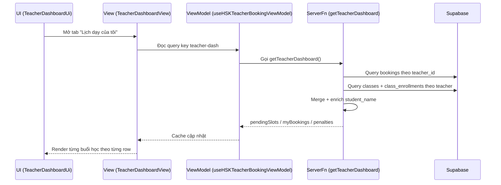

# Tổng quan hoạt động trang Giáo viên (Teacher Dashboard)

Tài liệu này mô tả kiến trúc, luồng dữ liệu và trạng thái hiện tại của trang Giáo viên trong HSK System.

---

## 1) Kiến trúc MVVM-lite

- **Route**: [src/routes/teacher.tsx](src/routes/teacher.tsx)
    - Cổng vào `/teacher`, bọc qua `DashboardShell`.
- **View (Controller)**: [src/components/features/teacher/HSK_TeacherDashboardView.tsx](src/components/features/teacher/HSK_TeacherDashboardView.tsx)
    - Gọi ViewModel, truyền props xuống UI, điều khiển tab.
- **UI (Presentation)**: [src/components/features/teacher/HSK_TeacherDashboardUi.tsx](src/components/features/teacher/HSK_TeacherDashboardUi.tsx)
    - Render các panel/table thuần UI.
- **ViewModel**: [src/hooks/hsk-viewmodels/HSK_useBookingViewModel.ts](src/hooks/hsk-viewmodels/HSK_useBookingViewModel.ts)
    - Quản lý query/mutation React Query cho teacher dashboard.
- **Server Functions**: [src/lib/hsk.functions.ts](src/lib/hsk.functions.ts)
    - Nguồn dữ liệu server-side cho dashboard.

---

## 2) Nguồn dữ liệu CSDL cho “Lịch dạy của tôi”

`getTeacherDashboard` đã được nối CSDL theo 2 nguồn:

1. **Bookings thực tế** (`public.bookings`)
     - Lọc theo `teacher_id = current_teacher_specific_id`.
     - Đây là các slot thật có thể hủy/chấm điểm.

2. **Lớp cố định** (`public.classes` + `public.class_enrollments`)
     - Lọc lớp theo `teacher_id` của giáo viên hiện tại.
     - Sinh danh sách từng buổi học theo `schedule_days`, `start_time`, `end_time`, `total_lessons`.
     - Mỗi học viên trong lớp sẽ có từng row theo từng buổi (giống pattern bảng “Lịch học của tôi” ở Student).
     - Các row này gắn cờ `is_enrollment_only = true` để phân biệt với slot thật.

> Ghi chú: để tương thích dữ liệu cũ, truy vấn lớp hỗ trợ nhiều khóa teacher (`specific_id`, `id`, `staff_code`).

---

## 3) Cấu trúc bảng “Lịch dạy của tôi”

Hiện bảng đã hiển thị các cột:

- **Mã lớp**: `class_id`
- **Học viên**: `student_name` + `student_id`
- **Thời gian**: `session_date`
- **Thời gian còn**: countdown cập nhật theo phút
- **Trạng thái**: `Đã hoàn thành` / `Đang diễn ra` / `Sắp diễn ra` / `Đã huỷ`
- **Hành động**: menu 3 chấm
    - Huỷ lớp
    - Điểm danh học viên
    - Chấm điểm học viên

### Quy tắc thao tác theo loại row

- **Row từ booking thật**: cho phép huỷ/chấm điểm theo điều kiện nghiệp vụ.
- **Row sinh từ enrollment (`is_enrollment_only`)**: chỉ dùng để hiển thị lịch; đã chặn huỷ/chấm điểm để tránh gọi API với `slot_id` ảo.

---

## 4) Các tab chính

1. **Học viên đang chờ nhận lớp** (`PendingSlotsTable`)
2. **Lịch dạy của tôi** (`MyBookingsTable`)
3. **Vi phạm của tôi** (`PenaltiesTable`)

---

## 5) Luồng dữ liệu cập nhật dashboard

